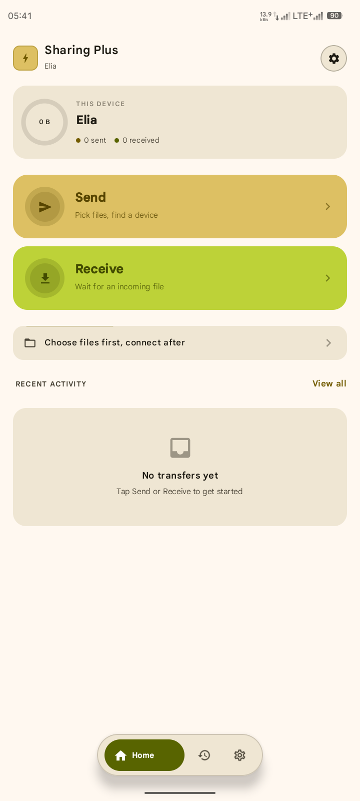
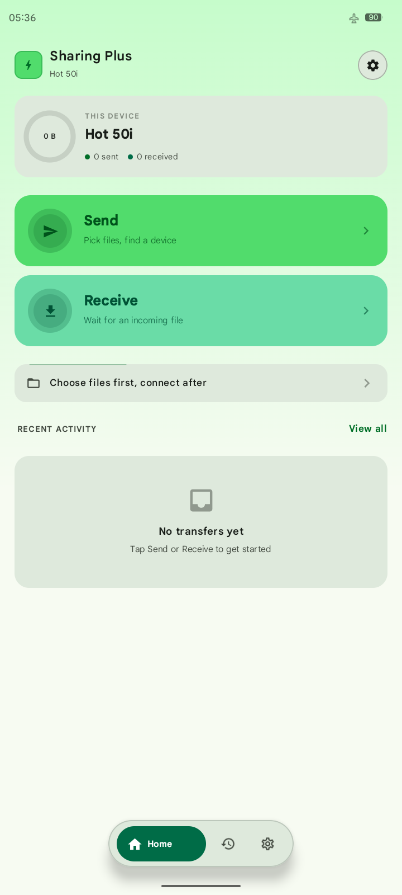
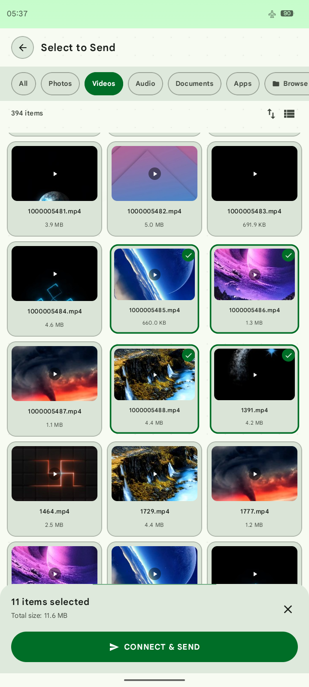
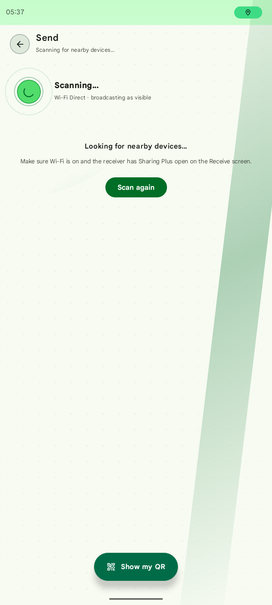
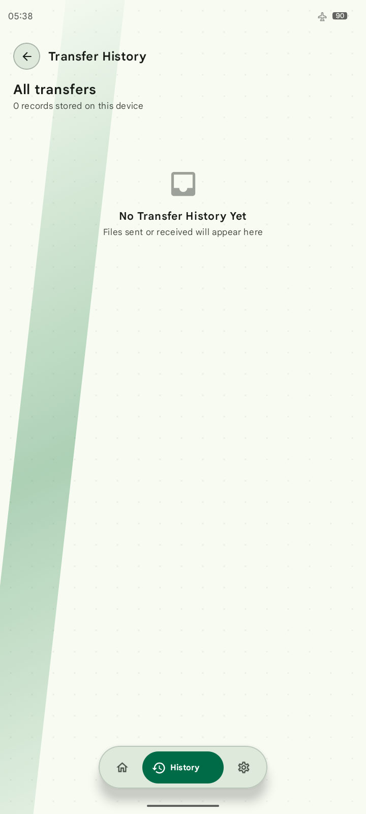
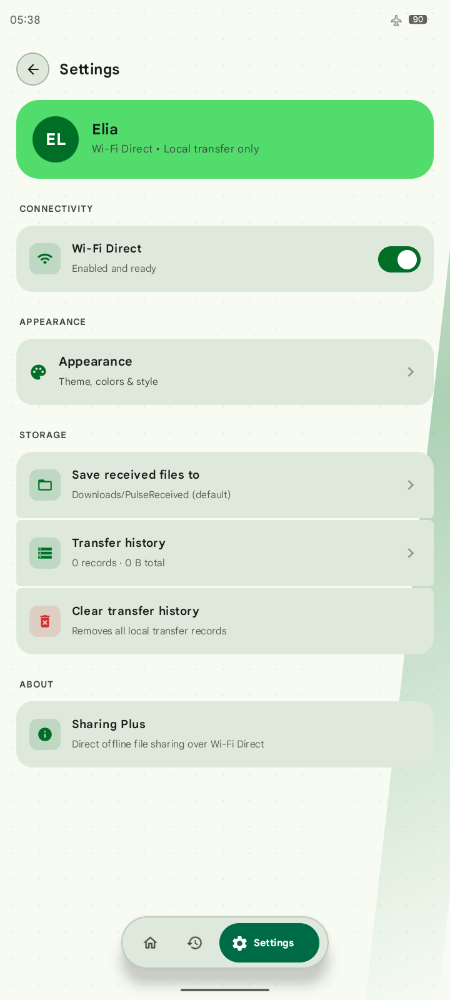
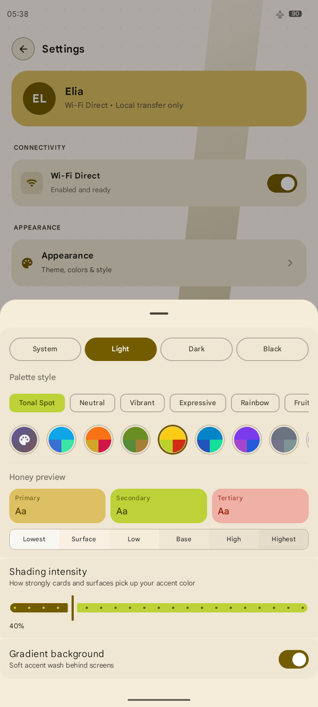

<div align="center">

# ⚡ Sharing Plus

**Blazing-fast peer-to-peer file sharing over Wi-Fi Direct.**
No internet. No cloud. No account. Scan a code, confirm it matches, and send.

[](#)
[-4CAF50?style=for-the-badge)](#)
[](#)
[](#)
[](#)

</div>

---

## 📱 Overview

**Sharing Plus** connects two Android devices directly over **Wi-Fi Direct** — no router, no internet, no account — and moves files at full Wi-Fi speed over a raw socket, with an optional forced-5GHz fast path. Pairing is confirmed with a short match code shown on both devices before a single byte moves. Every transfer is logged locally; nothing ever touches a server.

Built with **Jetpack Compose** and a fully dynamic **Material You** color system — 8 curated palettes, custom hex, or your wallpaper's own colors — so the screenshots below are just one of many looks the app can wear.

| | |
|---|---|
| **Package** | `com.willyshare.willykez` |
| **Min SDK** | 24 (Android 7.0) |
| **Language** | 100% Kotlin, Jetpack Compose |
| **Storage** | Room (local history only), SAF (custom receive folder) |
| **Network** | Wi-Fi Direct (`WifiP2pManager`), raw NIO sockets |

---

## ✨ Features

**🔗 Connectivity**
- Live Wi-Fi Direct peer discovery, with automatic re-scanning so it never silently goes stale
- QR pairing built around a *pull* model — the device with files ready shows a code; the receiving device scans it and pulls the cart
- Forced 5GHz "High-speed Mode" where the chipset supports it, with a clean auto-band fallback
- A 4-digit match code shown on both devices before any transfer begins — closes the "auto-trust whoever you land on" gap that QR/discovery flows otherwise have
- Self-correcting connection roles: whichever device actually ends up as Wi-Fi Direct's Group Owner vs. Client, the right side pushes and the right side pulls, automatically

**📤 Sending**
- Grouped file browser with thumbnails, category tabs, multi-select, and live search
- Cart is decoupled from connection — pick files first or connect first, in either order
- Files shared in from other apps land straight in the cart
- Parallel multi-stream sending with live per-file progress and a real-time speed graph

**📥 Receiving**
- Always-on background listener — no need to sit on the Receive screen
- Custom save folder via Storage Access Framework, or the app's own default directory
- Foreground service keeps receiving alive while backgrounded

**🎨 Design**
- Full Material You dynamic theming: 8 curated palettes, custom hex, or system wallpaper colors, each with light/dark/black variants and adjustable shading intensity
- A dot-grid mesh + radar-scan background and hairline-accented cards, generated fresh from whichever color you pick — not hardcoded to one look
- Bottom sheets for quick actions (QR display, QR scanning, theme picker) instead of full-page navigation where it doesn't need to be

**🔒 Trust & privacy**
- Every socket connection opens with an explicit intent byte — the wire protocol never guesses who's pushing and who's pulling
- Nothing is written to disk, and nothing is sent, until both devices' users confirm the same match code
- Transfer history is explicitly excluded from Android cloud backup — a "no cloud" app that actually stays off the cloud
- No analytics, no ads, no network calls beyond the direct peer-to-peer link

---

## 📸 Screenshots

<table>
<tr>
<td width="33%"></td>
<td width="33%"></td>
<td width="33%"></td>
</tr>
<tr>
<td align="center"><sub><b>Home</b> — dynamic theming in action</sub></td>
<td align="center"><sub><b>Home</b> — same layout, different palette</sub></td>
<td align="center"><sub><b>Select to Send</b> — grid, search, categories</sub></td>
</tr>
<tr>
<td width="33%"></td>
<td width="33%"></td>
<td width="33%"></td>
</tr>
<tr>
<td align="center"><sub><b>Send</b> — live discovery</sub></td>
<td align="center"><sub><b>History</b> — local-only transfer log</sub></td>
<td align="center"><sub><b>Settings</b> — connectivity & appearance</sub></td>
</tr>
</table>

<p align="center"></p>
<p align="center"><sub><b>Appearance</b> — palette style, tonal previews, shading intensity, all live</sub></p>

---

## 🧠 How a transfer actually happens

A small mode-byte protocol sits on top of raw TCP, plus a separate one-shot handshake connection for the match-code confirm:

```
1. HANDSHAKE  (its own short-lived connection, always first)
   dialer → [MODE_HANDSHAKE][device name][4-digit code][push/pull]
   acceptor's user sees the code, taps Confirm/Decline
   acceptor → [1 = confirmed | 0 = declined]
   dialer's own user must ALSO confirm locally before this counts as a yes

2. TRANSFER  (only opened if step 1 returned true)
   MODE_PUSH: dialer writes  [fileCount][name, size, bytes]...  → acceptor reads & saves
   MODE_PULL: dialer requests → acceptor (who has the cart) switches roles for this
              connection and writes its files down the same socket instead
```

The always-on receive listener never has to guess who's connecting or why — the first byte always tells it. And because the handshake is its own connection, a parallel multi-stream send never triggers duplicate confirm prompts.

---

## 🏗️ Project structure

```
app/src/main/java/com/willyshare/willykez/
├── MainActivity.kt          — Compose navigation host, global PIN confirm sheet, back-stack
├── net/                     — Wi-Fi Direct, raw socket transfer protocol, QR payload codec
│   ├── WifiDirectManager.kt
│   ├── FileTransfer.kt      — FileSenderClient / FileReceiveServer, the mode-byte protocol
│   └── QrPairing.kt
├── ui/
│   ├── PulseViewModel.kt    — single source of truth: cart, connection state, transfer state
│   ├── theme/                — dynamic Material You color derivation, curated palettes
│   └── screens/               — one file per screen/sheet
├── data/                    — Room database (local transfer history only)
├── service/                 — foreground service keeping receive-listening alive
└── util/                    — notifications, share-intent handling, battery/Wi-Fi helpers
```

---

## 🛠️ Building

Standard Android Studio / Gradle project. Wi-Fi Direct doesn't work in the emulator — two physical devices are needed to test any actual transfer.

```bash
./gradlew assembleDebug
```

---

<p align="center"><sub>Built independently. No ads, no tracking, no cloud.</sub></p>
